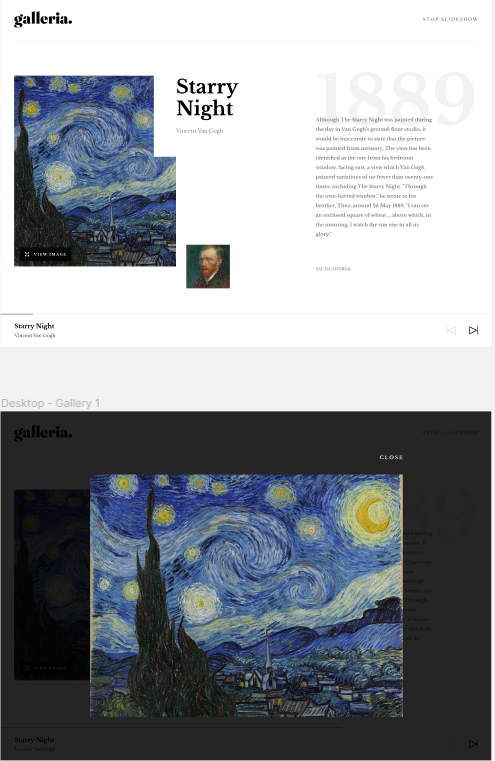
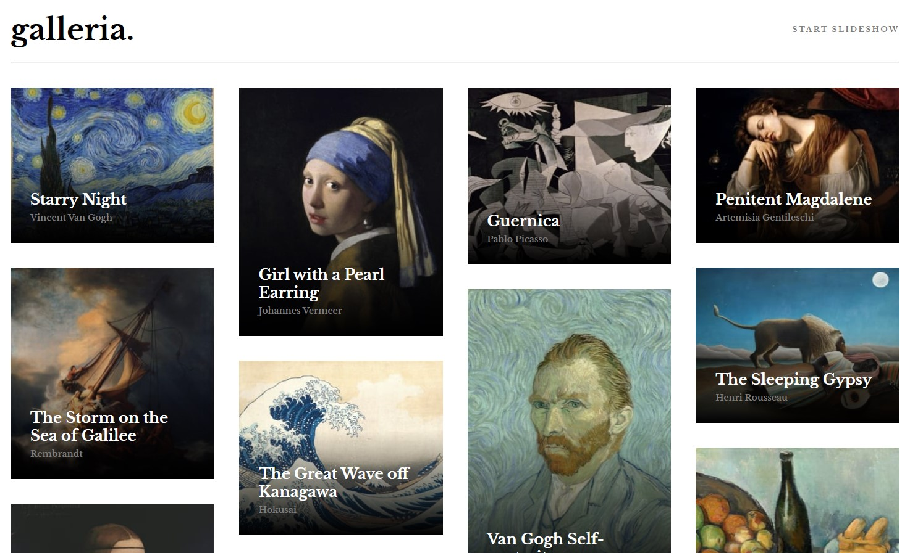
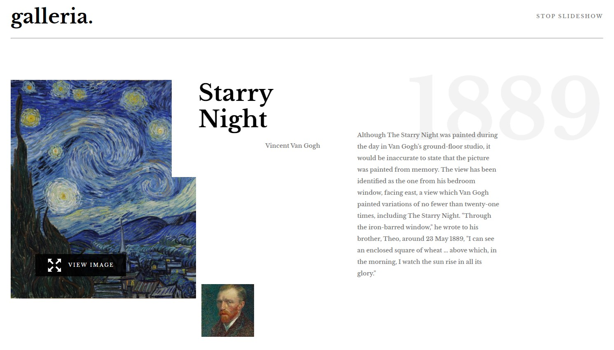

# Frontend Mentor - Galleria slideshow site solution

(this is what the result should look like)

### The challenge

Users should be able to:

- View the optimal layout for the app depending on their device's screen size
- See hover states for all interactive elements on the page
- Navigate the slideshow and view each painting in a lightbox

It's a multipage website where every art work is link to an individual page where we can check the different details of the masterpiece and author autoportrait

### Screenshot

### Links

- Solution URL: [Add solution URL here](https://your-solution-url.com)
- Live Site URL: [Add live site URL here](https://your-live-site-url.com)

## My process

### Built with

- Semantic HTML5 markup
- CSS custom properties
- Flexbox
- CSS Grid
- Mobile-first workflow
- [React](https://reactjs.org/) - JS library
- Vite - Set up env

### Actule state of the project 
Not finished at 100%
some adjustmenets need to be done on the phone size screen design  